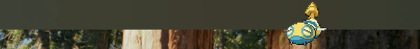

# PokeNotch

A macOS menu bar app that displays animated Pokémon sprites right next to your MacBook's notch.

## Features

- Animated Gen 5 (Black/White) pixel art sprites from [PokeAPI](https://pokeapi.co/)
- Crisp nearest-neighbor scaling for that retro look
- Floats next to the notch on MacBooks (centers on top of screen for non-notch Macs)
- Auto-refreshes with configurable intervals (1, 2, 5, 10, 15, or 30 minutes)
- Shows the current Pokémon's name and number in the menu
- Covers all 649 Gen 1–5 Pokémon

## Requirements

- macOS 12.0+ (for notch detection)
- Xcode 14+

## Build & Run

1. Open `PokeBar/PokeBar.xcodeproj` in Xcode
2. Build and run (⌘R)

The Pokémon sprite will appear next to your notch, and a small menu bar icon gives you controls.

## Menu Options

- **Refresh Now** — get a new random Pokémon
- **Interval** — set auto-refresh timer
- **Pokémon name** — shows the current sprite's name and Pokédex number
- **Quit PokeBar** — exit the app
